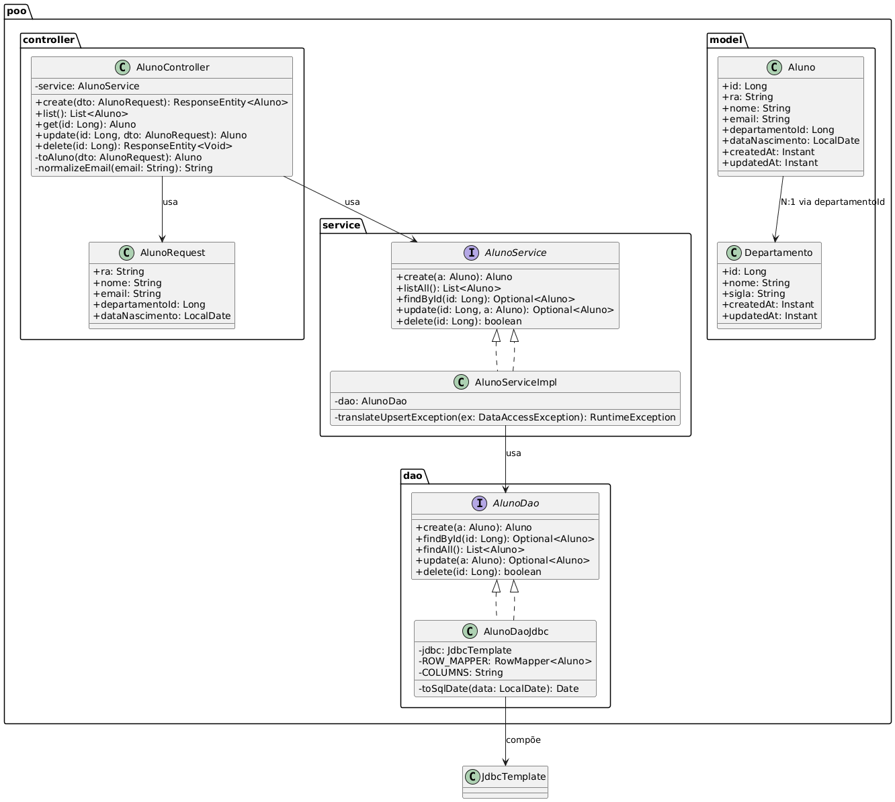
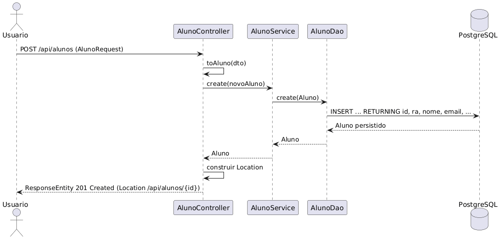

# Trabalho Final - Programacao Orientada a Objetos 2 (POO2)

Este repositorio reune a solucao full-stack desenvolvida para o trabalho final da disciplina de Programacao Orientada a Objetos 2. A aplicacao simula um portal academico simplificado e serve como laboratorio para praticar arquitetura em camadas, encapsulamento de regras de negocio e integracao com um banco relacional.

A avaliacao enfatiza boas praticas de OO: as entidades e DTOs representam o dominio, enquanto controllers, services e DAOs demonstram como aplicar SOLID em um projeto realista. O banco de dados, o frontend e a infraestrutura Docker entram como suporte para exercitar e validar esses conceitos.

## Visao Geral da Solucao
- `backend/`: API REST com Spring Boot. Controllers expõem endpoints HTTP, services concentram regras e DAOs JDBC executam SQL versionado por Flyway.
- `frontend/`: SPA Vue 3 + Pinia usada para testar fluxos de cadastro, listagem e autenticacao simulada.
- `infra/`: definicoes Docker Compose que sobem Postgres e demais dependencias locais.
- `docs/`: diagramas UML, relatorio e referencias utilizadas durante a disciplina de POO2.

## Objetivos de Aprendizagem
- Consolidar principios de OO (encapsulamento, responsabilidade unica, inversao de dependencia) aplicados a um dominio universitario.
- Implementar MVC + DAO manualmente, explorando interfaces e injecao de dependencias do Spring em vez de abstrair tudo com ORMs.
- Demonstrar como regras de negocio e validacoes residem em services, separando-as das camadas de transporte e persistencia.
- Entregar uma API REST e uma SPA que permitam testar as funcionalidades e observar o comportamento das camadas.

## Conceitos e Tecnicas de POO aplicados
- Camadas `Controller -> Service -> DAO` desacopladas por interfaces (`AlunoService`, `AlunoDao`, etc.) para facilitar testes e evolucao.
- DAOs implementados com `JdbcTemplate` e `RowMapper`, demonstrando o padrao DAO em cima de SQL parametrizado.
- Services encapsulam regras (unicidade de RA/email, protecao contra exclusoes com dependencias) e traduzem excecoes de infraestrutura para respostas HTTP coesas.
- DTOs com Bean Validation garantem pre-condicoes antes de delegar para o dominio.
- Uso de `HttpSession` para ilustrar autenticacao baseada em sessao e como o estado do usuario pode ser consumido pelos controllers.
- Documentacao automatica com Swagger/OpenAPI para reforcar contratos e facilitar exploracao dos endpoints.

## Dominio e Funcionalidades
- Entidades principais: `departamento`, `aluno`, `prova`, `nota` e `usuario`.
- CRUD completo para departamentos, alunos, provas e notas, expondo validacoes como RA unico, relacao aluno-departamento e consistencia entre provas/notas.
- Endpoint `GET /api/health` para verificacao rapida do backend.
- Fluxo simples de autenticacao (`/api/auth/login`, `/api/auth/me`, `/api/auth/logout`) que demonstra como persistir informacoes do usuario na sessao.

## Arquitetura e Diagramas

### MVC + DAO (backend)


O diagrama realca a divisao em camadas pedida na disciplina: controllers tratam HTTP, services isolam regras de negocio e DAOs controlam o acesso a dados. Essa separacao facilita evoluir regras de OO sem acoplar transporte e persistencia.

### Sequencia de criacao de aluno


O fluxo destaca a conversa entre frontend, controller, service e DAO na insercao de um aluno. O objetivo e evidenciar os pontos em que validacoes de dominio acontecem antes de efetivar a transacao no banco.

## Estado da Autenticacao
- As rotas de negocio (`/api/alunos`, `/api/departamentos`, etc.) nao verificam a sessao e podem ser chamadas sem realizar login.
- O login em `/api/auth/login` apenas grava `userId`/`userName` na sessao para que `/api/auth/me` consiga identificar o usuario atual.
- O projeto nao inclui Spring Security ou interceptadores; por isso, o fluxo de autenticacao serve apenas como mock para a disciplina.
- Para tornar o login obrigatorio, adicione um mecanismo de seguranca real (Spring Security, JWT ou um `HandlerInterceptor` que rejeite requisicoes sem `userId`).

## Scripts de Migracao (Flyway)
Mesmo com o foco voltado para POO, mantemos o schema do Postgres versionado para garantir reproducao do ambiente.

- `V1__init.sql`: funcoes auxiliares, tabelas `departamento` e `aluno`, indices e gatilhos de auditoria.
- `V2__provas_notas.sql`: cria `prova` e `nota`, assegurando integridade entre departamentos.
- `V3__auth_usuario.sql`: habilita `pgcrypto` e registra `usuario` com hash BCrypt.
- `V4__seed_dados_iniciais.sql`: popula dados de referencia para testar os fluxos.

Novas evolucoes devem ser adicionadas em `backend/src/main/resources/db/migration` ou `infra/db/migrations`. As migrations sao aplicadas automaticamente ao subir o backend ou via `mvn flyway:migrate`.

## Requisitos de Ambiente
- Java 21 e Maven
- Node.js 18+ e npm
- Docker e Docker Compose
- Opcional: psql ou outro cliente SQL para inspecao manual

## Preparacao do Ambiente

### Execucao completa com Docker

#### Ambiente de desenvolvimento (build local)
```bash
docker compose up --build
```
O Compose utiliza os `Dockerfile` do backend e do frontend para gerar as imagens locais. A API responde em `http://localhost:8080/api` e a SPA em `http://localhost:5173`. Para desligar, execute `docker compose down`.

#### Consumir imagens publicadas (sem build)
Disponibilizamos imagens prontas no GitHub Container Registry. Utilize `docker-compose.images.yml` para baixa-las e subir o ambiente sem build local.

#### Baixar apenas o compose de imagens
Para usar somente as imagens publicadas, clique no link abaixo e baixe o arquivo:
- [docker-compose.images.yml](https://github.com/phcastello/Trabalho1-POO2/blob/main/docker-compose.images.yml)

Para subir:
```bash
docker compose -f docker-compose.images.yml up -d
```

Para desligar:
```bash
docker compose -f docker-compose.images.yml down
```

### Execucao manual passo a passo

1. Banco de dados
   ```bash
   docker compose -f infra/docker-compose-db.yml up -d
   ```
   O Postgres fica exposto em `localhost:55432` (`poo_user` / `poo_pass`). Seeds sao aplicadas pelas migrations do backend. Para acessar diretamente:
   ```bash
   docker exec -it poo_postgres psql -U poo_user -d poo
   ```

2. Backend
   ```bash
   cd backend
   mvn spring-boot:run
   ```
   A API fica disponivel em `http://localhost:8080/api`. Endpoints principais:
   - `GET /api/health` para verificar disponibilidade
   - `POST /api/auth/login` para autenticar (usuario `admin` / `senha123`)
   - CRUD de `alunos`, `departamentos`, `provas` e `notas`
   - Swagger UI em `http://localhost:8080/swagger-ui.html`

3. Frontend
   ```bash
   cd frontend
   npm install
   npm run dev
   ```
   Acesse `http://localhost:5173`. Ajuste `VITE_API_BASE_URL` no `.env.local` caso a API esteja em outro host.
