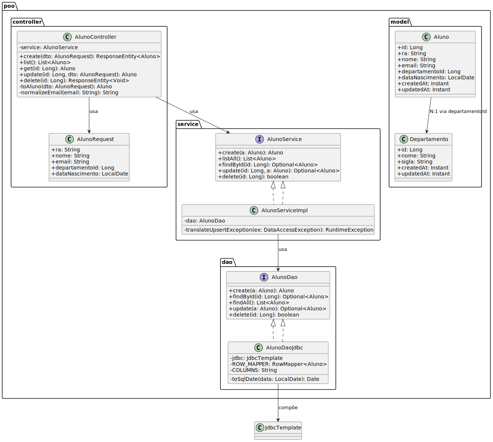
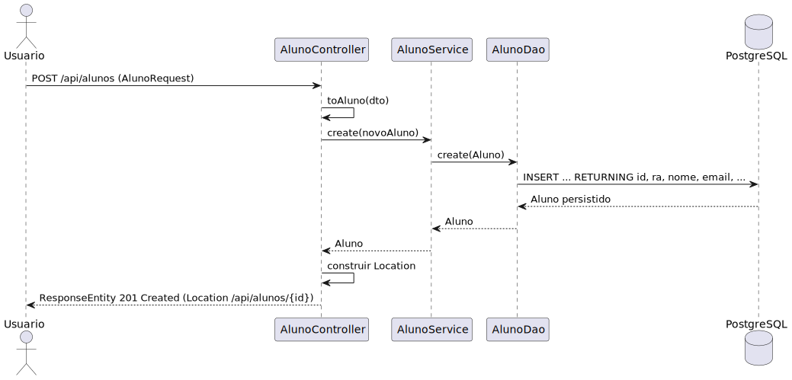

# Trabalho 1 - POO2

Aplicacao full-stack para gestao academica composta por um backend Spring Boot (REST + DAO/JDBC), um frontend Vue 3 com Pinia e uma infra Docker para o banco Postgres.

- `backend/`: servico REST exposto em `http://localhost:8080/api`, autenticacao via sessao HTTP e migrations Flyway.
- `frontend/`: SPA criada com Vite, configura a URL base da API via `VITE_API_BASE_URL`.
- `infra/`: `docker-compose` para subir o banco Postgres com credenciais de desenvolvimento (`poo_user` / `poo_pass`).

## Diagramas da arquitetura

### MVC + DAO



O desenho mostra os papéis de cada camada do backend. A controller REST recebe as requisições HTTP, delega a validação e as regras de negócio para a service, que por sua vez utiliza a camada DAO baseada em JDBC para acessar o banco relacional. O diagrama também deixa explícito que as entidades de domínio (`Aluno`, `Departamento`, etc.) trafegam entre service e DAO, enquanto os DTOs ficam restritos às bordas da aplicação, garantindo separação de responsabilidades e isolamento de tecnologia na camada de persistência.

### Sequência de criação de aluno



Este fluxo detalha a interação ponta a ponta quando um usuário cadastra um aluno pelo frontend. A chamada inicia na interface Vue, que consome o endpoint `POST /api/alunos` da controller. A controller valida os dados, aciona a service para aplicar regras como verificação de departamento e, em seguida, a service chama o DAO JDBC para persistir o novo registro. O diagrama ilustra o retorno em cadeia das respostas, incluindo como a service encapsula mensagens de erro e como a controller converte o resultado em uma resposta HTTP adequada para o cliente.

## Requisitos

- Java 21 e Maven
- Node.js 18+ e npm
- Docker e Docker Compose

## Subindo o ambiente

1. Banco de dados  
   ```
   docker compose -f infra/docker-compose-db.yml up -d
   ```
   O container expoe o Postgres em `localhost:55432` e as migrations Flyway rodam automaticamente quando o backend inicia. Seeds criam dados iniciais de alunos, provas, notas e um usuario `admin` com senha `senha123`.

2. Backend
   ```
   cd backend
   mvn spring-boot:run
   ```
   A API ficara disponivel em `http://localhost:8080/api`. Endpoints principais:
   - `GET /api/health` - verificacao basica
   - `POST /api/auth/login` - autentica e cria sessao (usa cookie)
   - `GET /api/auth/me` - retorna o usuario autenticado
   - `POST /api/auth/logout` - encerra a sessao

3. Frontend  
   ```
   cd frontend
   npm install
   npm run dev
   ```
   Acesse `http://localhost:5173`. O login padrao e `admin` / `senha123`. Ajuste `VITE_API_BASE_URL` no arquivo `.env.local` se necessario.

## Testes e utilidades

- Backend: `mvn test`
- Frontend: `npm run check`
- Para resetar o banco, derrube o container (`docker compose down -v`) e suba novamente.
